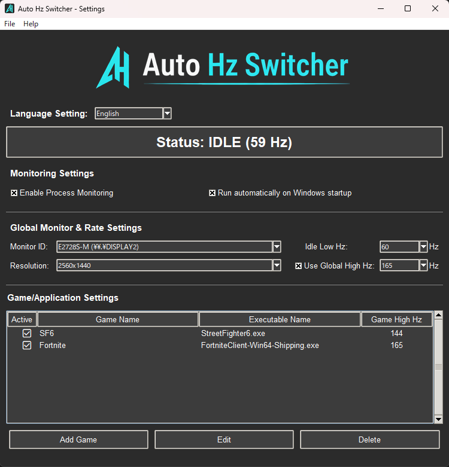
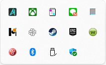

# AutoHzSwitcher

**Automatic refresh rate switching for Windows**
Run games at high refresh rates, return to low refresh rates automatically when idle.

---

## What is this?

If you use a high refresh rate monitor (144Hz / 165Hz / 240Hz), you probably don’t need that refresh rate all the time.

Before gaming, you switch to high Hz.
After quitting a game… you forget to switch it back.

AutoHzSwitcher is a small Windows utility that **automatically switches your monitor refresh rate based on running applications**, with **zero interaction after setup**.

---

## Key Features

* Runs quietly in the system tray
* Monitors running processes
* Switches to a higher refresh rate while a registered game/app is running
* Returns to a lower refresh rate when no registered app is active
* Supports multi-monitor setups
* No background services, no online dependency

---

## How It Works

1. AutoHzSwitcher runs in the background
2. It monitors active processes
3. When a registered executable starts → refresh rate switches to **High Hz**
4. When all registered executables stop → refresh rate switches back to **Low Hz**

This logic is entirely local and event-driven.

---

## Screenshots

---

## Typical Use Case

| Situation                    | Refresh Rate           |
|------------------------------|------------------------|
| Desktop / Browsing           | 60 Hz                  |
| Gaming (e.g. SF6, Fortnite)  | 144–165 Hz             |
| Game closed                  | Automatically returns  |

---

## Installation

1. Download the installer from the Releases page
2. Run the installer
3. Add games or applications by executable name
4. Set your preferred high / low refresh rates

Once configured, no further interaction is required.

---

## Why the Source Code Is Public

This project is **source-available, not open-source**.

The source code is published for:

* Transparency
* Learning purposes
* User trust

Compilation, redistribution, or commercial use of derived binaries is **not permitted**.

Please see the LICENSE file for details.

---

## License

This software is released under a **proprietary license**.

* Personal, non-commercial use only
* Redistribution prohibited
* Source code provided for inspection only

Third-party components are licensed under their respective licenses.

---

## Platform

* Windows 10 / 11
* Tested with high refresh rate monitors

---

## Author

Developed by **Fishbone Software**.

Feedback and questions are welcome.
